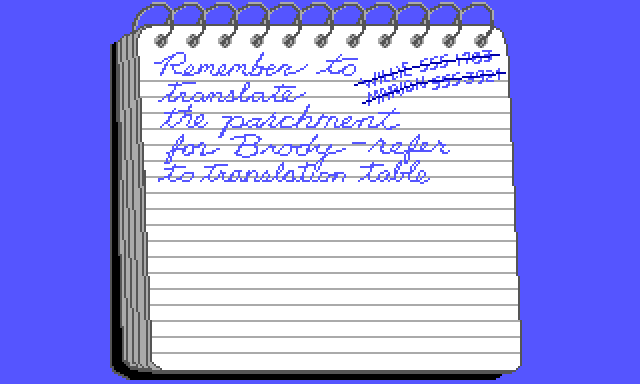

# Indy 3 (Atari ST) — copy protection, reverse engineered

Reverse engineering of the copy protection in *Indiana Jones and the Last
Crusade: The Graphic Adventure*, Atari ST, Kixx release (SCUMM v3, `indy3`),
starting from three Pasti/STX floppy dumps.

**The disks carry no copy protection at all.** All 480 formatted tracks are
ordinary MFM: no fuzzy bits, no deliberate CRC errors, no duplicate or
out-of-range sector IDs, no long tracks. The lock was a printed card — the
Translation Table — read through a red filter so it could not be photocopied.

The interesting part is that the card's contents are not stored anywhere. They
are *computed* from the prompted coordinate by 333 bytes of deliberately
convoluted integer arithmetic, so the routine **is** the card. Running it over
every coordinate regenerates the whole thing.



## How the check works

Entering room 92 rolls a coordinate and asks for it:

```
row     = getRandomNr(25) + 1     ; 1..26, shown as a letter A-Z
column  = getRandomNr(6)  + 1     ; 1..7
section = getRandomNr(3)  + 1     ; 1..4
print "Check Section <section>, Row <letter>, Column <column>."
```

You enter four symbols from a twelve-glyph alphabet. They are compared against
`expect1..4`, which are derived from the coordinate using only add, subtract and
compare — no multiply, no lookup table. Each symbol folds in a previously
computed one, so a single cell cannot be worked out in isolation.


Failing three times ends the scene anyway and costs one line of dialogue
(*"I'm disappointed in you!"* instead of *"Good work, Indy!"*). The flag it sets
is a scratch variable reused elsewhere, not a persistent record.

## Contents

| Path | What |
|---|---|
| `docs/analysis-report.pdf` | The full write-up, with annotated bytecode |
| `docs/translation-card.pdf` | The Translation Table, reconstructed and printable |
| `translation_table.txt` | The same card as text — 4 × 26 × 7 = 728 cells |
| `room92_disassembly.txt` | Annotated disassembly of the protection scripts |
| `tools/pasti.py` | Pasti/STX floppy image parser |
| `tools/render.py`, `tools/obj.py` | SCUMM v3 EGA room and object bitmap decoders |
| `tools/scummdis.py` | SCUMM v3 bytecode disassembler |
| `tools/keygen.py` | The answer-derivation routine, transcribed |
| `tools/patch_protection.py` | Disables the check in a raw `.st` image |
| `figures/` | Screens and sprites decoded from the game |

## No game data here

This repository deliberately contains **no disk images and no game files** —
`.stx`, `.st`, `.LFL`, `INDY.PRG`. The tools expect you to supply your own dumps
of media you own. `.gitignore` is set up to keep them out.

## Reproducing

```sh
cd tools
python3 keygen.py                          # ranges + a sample of the card
python3 render.py <decoded-room.LFL>       # room background -> png/
python3 scummdis.py <decoded-room.LFL> <start> <end>
python3 patch_protection.py disk1.st skip  # or: accept
```

`.LFL` resources are XOR `0xFF` on disk; decode before feeding them to the
renderer or disassembler. `98.LFL` and `99.LFL` are the exception — they are the
character sets and are stored unobfuscated.

Three details that silently produce garbage if you get them wrong:

* **Pasti.** The track-image length is the size word itself, not size minus the
  header, and each track record is padded to an even length. Sector
  `dataOffset` values are relative to the start of the track-image block, not
  the sector-data area. Get it right and the last sector ends exactly on the
  record boundary — a free correctness check.
* **Object bitmaps.** Objects use the room strip encoding but store no height.
  Solve for it: the height is the value that makes each decoded strip consume
  exactly the distance to the next offset in the table.
* **Comparison opcodes.** SCUMM evaluates conditionals as `operand2 OP variable`,
  not variable-first. Reading them the intuitive way inverts every branch in the
  derivation. Related: opcode `0xAE` in v3 is a standalone `waitForMessage`, not
  the v5 `wait` with a subopcode byte.

## Status

Everything here is verified statically — patches are applied to a copy, the
resource is pulled back out through the filesystem, decoded and re-disassembled.
Nothing has been run in an emulator.
